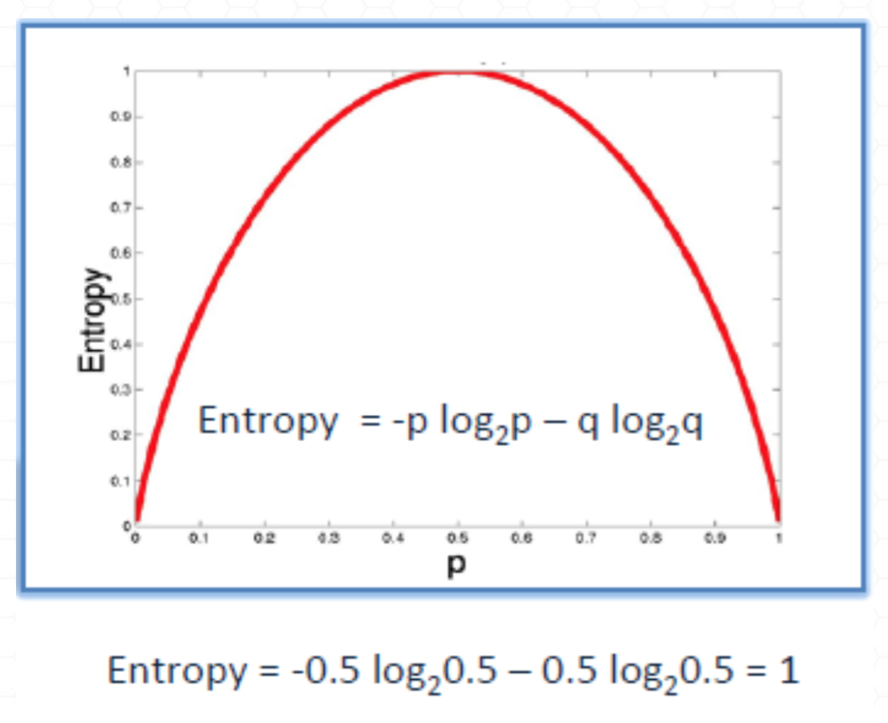
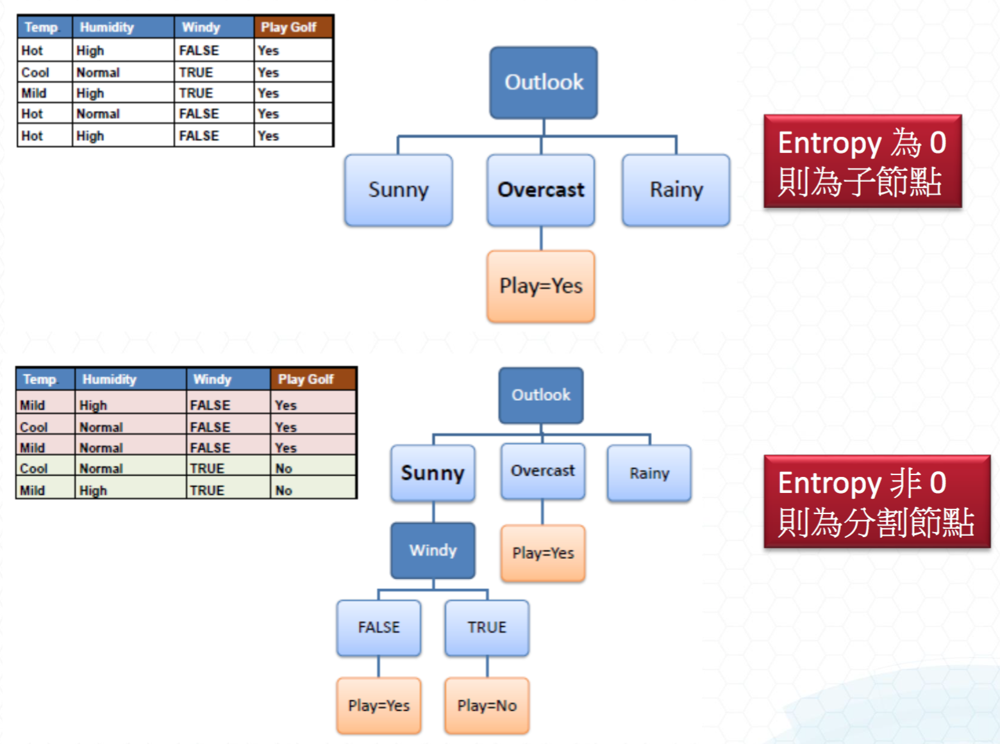
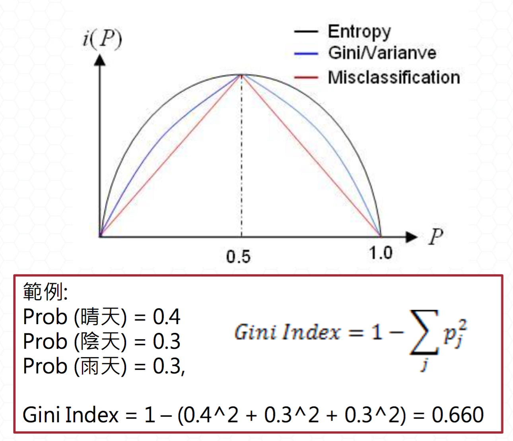
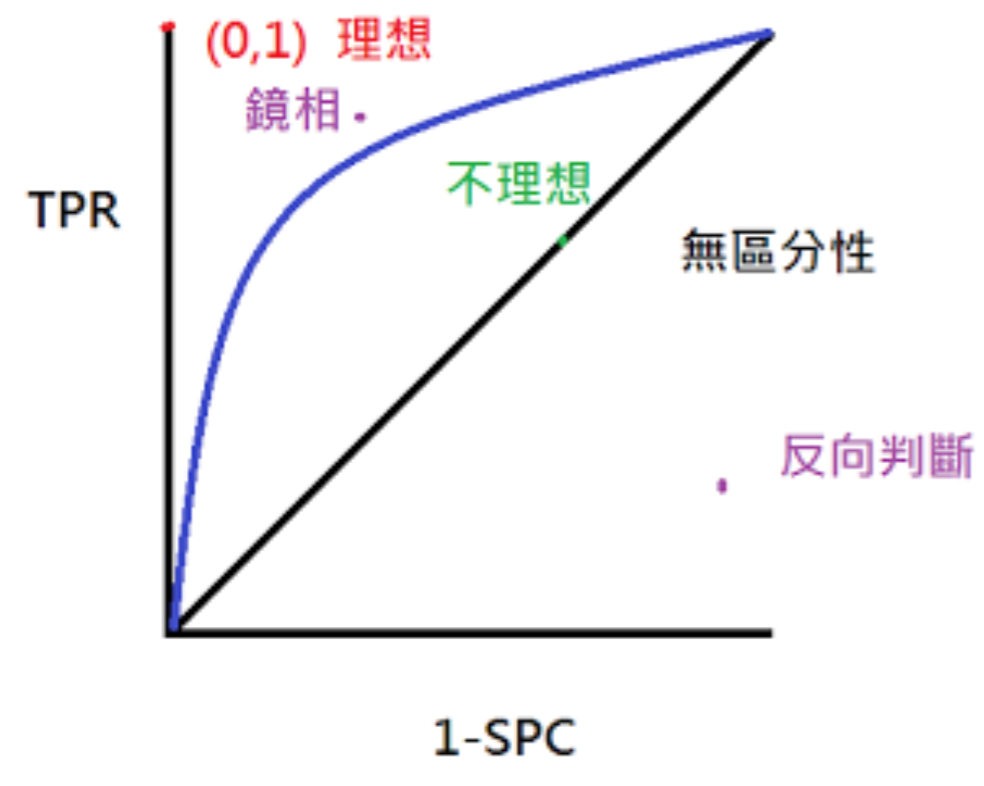

# 分類
[RPubs](http://rpubs.com/a5347354/202019)
## 決策樹
### Entropy 糾結程度
> 計算系統中的失序現象，計算該系統混亂的程度
>  在歷史當中，去打高爾夫球的機率剛好一半時
>  => **當我不知道如何選擇時，糾結程度會最高**
> 

> 
 Entropy = 0 為子節點
>   Entropy <> 0 為分割節點
> 

### Infromation Gain
> Information Gain **越高**越可以決定我要不要去

### Gini Impurity
> 

### 過度學習
> 當訓練模型與測試模型都為同一份時，會有球員兼裁判的嫌疑
> 
避免過度學習：**剪枝prune**

#### 計算準確率：使用caret裡的Confusion Matrix

### 當測試模型準確率下降時，此訓練資料的模型有過度學習之虞
> 使用cross validation
> 把所有模型都建立出來，並選擇出最好的模型

### 做機器學習之前，先用人的角度去思考

### 如果模型準確率比人猜得還要低，那此模型就沒有參考價值

### ROC 曲線 receiver operating characteristic
> 不可以只取機率比較大的，準確率不一定非常客觀，採用**ROC曲線**
> 用客觀的角度，算出所有的機率
> 
將不同閾值threshold的所有機率畫出來
> 
值越大，面積涵蓋的越大，模型預測能力越好，會介於 1 > x > 0.5
> 

> #### AUC 曲線下面幾 Area Under Curve

## SVM
> 特色：用曲線去切
> 
優點：非常準確
> 
缺點：非常耗時，尤其資料量超過1萬

## 最準的演算法前三
> random forest、SVM、naive bayes

## Naive Bayes分類器
> 條件機率
> 
文章中每個可以視為獨立，使用貝式分類應用在**文章分類**

## 文章資料通常用兩種演算法
>  - SVC
>  - Naive Bayes：資料要互相獨立
